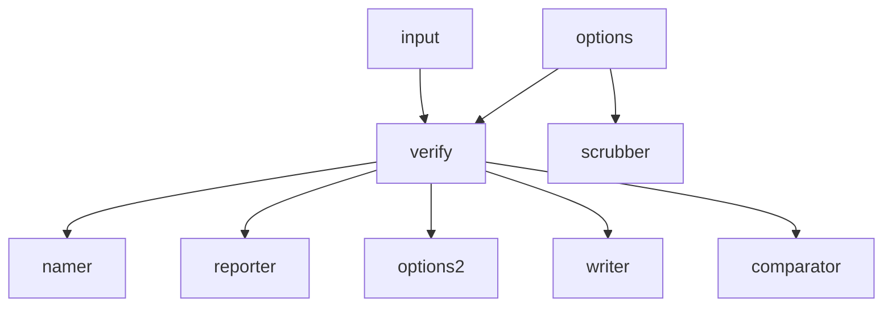
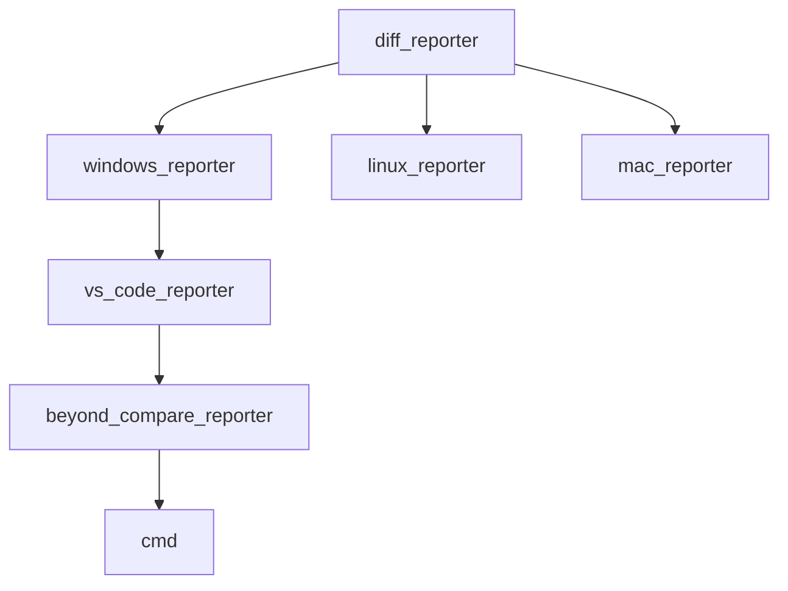
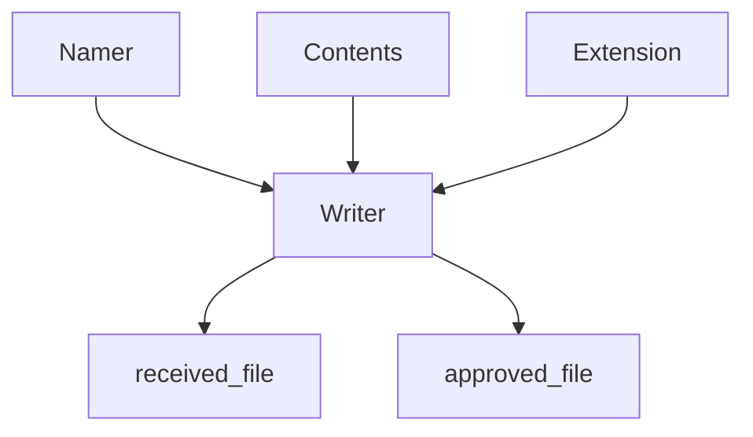
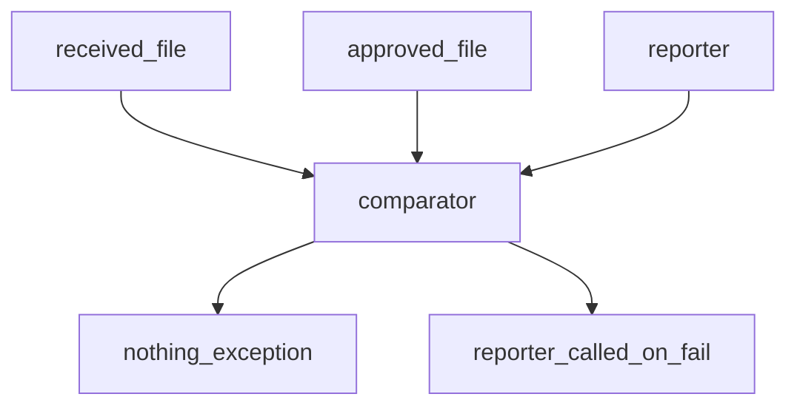
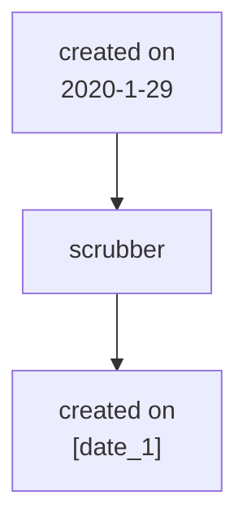

# Architecture

This is an overview of the components of a full approval test implementation.  

Approval testing is a specific form of testing that complements other kinds.

[Approval Test Website](https://approvaltests.com/)



options contains namer

## Namer
approval file - guilded_rose_test.approval_test.approved.txt  
received file - guilded_rose_test.approval_test.received.txt  
general - file_name.test_name.approved.extension

(access name of test in exunit?)

## Reporter
```elixir
def report(approved, received) do
    true
end
```



## Writer
Takes content + namer and produces two files  
mostly text but may be other types



## Comparator


Line endings! - still a thing
usually a file comparator

## Scrubbers
Makes input consistent

```elixir
def scrub(text) do
    text
end
```



## Options
Immutable bag (just a hashmap of properties) with reasonable defaults  
Most verify functions hava an optional options (if you pass it in it is taken into account)  

